# Integration of Lean Manufacturing and Industry 4.0 — Smart Manufacturing Framework (UK Automotive)

**Author:** Akash P Raj  
**Program:** Engineering Management (Project)  
**Duration:** **15 July 2023 – 31 August 2023** (≈ 1.5 months)

> **Provenance:** This repository reconstructs my Master’s project for portfolio purposes. Original dissertation artefacts are not public; all data here is **synthetic** and used to demonstrate method, analysis, and documentation discipline.

---

## 📌 Overview
This project develops a practical **Smart Lean Manufacturing** framework that integrates **Lean** principles with **Industry 4.0** technologies for the **UK automotive sector**. It consolidates literature, case insights, and a phased implementation roadmap toward **data-driven, connected, and adaptive** operations.

> **Goal:** Build and validate a phased framework that improves **productivity, quality, flexibility, and sustainability** while addressing **people, process, technology, and cybersecurity**.

---

### 📄 Full Dissertation (PDF)
See **“Integration of Lean Manufacturing and Industry 4.0: A Framework for Smart Manufacturing in the UK Automotive Sector”** (submitted 15-Sept-2023).  
[`docs/Dissertation_Akash_P_Raj_Lean_I4.0_UK_Automotive_2023.pdf`](docs/Dissertation_Akash_P_Raj_Lean_I4.0_UK_Automotive_2023.pdf)

*Provenance highlights:* title/cover and submission details (p.1); aim, objectives and scope (pp. 2–4, 10); phased roadmap & validation plan (pp. 36–46); conclusion & recommendations (pp. 47–49). :contentReference[oaicite:2]{index=2}

---

## 🎯 Objectives
1. Assess Lean adoption, challenges, and opportunities in UK automotive.  
2. Map relevant Industry 4.0 technologies to Lean value streams.  
3. Design a phased implementation roadmap (assessment → pilots → scale).  
4. Define KPIs for validation (productivity, quality, cost, **OEE**, energy, lead time).  
5. Address human factors, training, and cybersecurity for safe adoption.

---

## 🧭 Method (High-Level)
- Systematic literature synthesis (+ UK automotive case insights).  
- Framework design: **Lean × I4.0 convergence**, **value-stream-centric**.  
- Validation plan: pilot facility selection, monitoring, and **iterative optimisation**.  
- KPIs: balanced **operational** and **strategic** indicators.

---

### Roadmap at a glance

---

## 🧩 Framework (Lean × I4.0)
- **Lean core:** Waste elimination, flow, JIT, **Jidoka**, **Kaizen**, **VSM**, **TPM**, **SMED**.  
- **I4.0 enablers:** IoT sensors, CPS, robotics/AGVs, analytics/**AI-ML**, digital twins, AR, MES.  
- **Phases:** **Readiness** → **Tech selection** → **Pilot** → **Scale** → **Interconnect** → **Data-driven optimisation** → **Training** → **Continuous improvement**.

---

## 🧪 Case Snapshots (UK automotive)
- **Jaguar Land Rover (JLR):** Data-driven decisions; smart lines (robots/AGVs); mass-customisation with improved efficiency and synchronised supply; human–machine collaboration.  
- **Bentley Motors UK:** VSM + Kaizen + TQM; IoT sensing, analytics, and digital twins for predictive maintenance and quality.

> Note: Literature-based case insights; no proprietary data.

---

## 📈 KPIs (examples used in validation plan)
- **Productivity:** Throughput, cycle time, flow efficiency, **OEE**  
- **Quality:** First-pass yield, defects per million (DPMO), rework rate  
- **Cost/Energy:** Conversion cost per unit, **kWh/unit**, maintenance cost  
- **Flexibility:** Changeover time (**SMED**), mix responsiveness  
- **Sustainability:** Energy intensity, scrap rate, **CO₂e per unit**  
- **People:** Training hours, ergonomics incidents, idea implementation rate

> See **Section 4.7.2 (KPIs and Metrics)** in the dissertation for context.

---

#### KPI tree

```mermaid
flowchart TB
  R["KPI Tree<br/>(Operations &amp; Improvement)"]

  R --> P["Productivity"]
  R --> Q["Quality"]
  R --> C["Cost &amp; Energy"]
  R --> F["Flexibility"]
  R --> S["Sustainability"]
  R --> H["People"]

  P --> P1["Throughput"]
  P --> P2["Cycle Time"]
  P --> P3["OEE"]

  Q --> Q1["First-Pass Yield"]
  Q --> Q2["DPMO"]
  Q --> Q3["Rework Rate"]

  C --> C1["£ per Unit"]
  C --> C2["kWh per Unit"]
  C --> C3["Maintenance £"]

  F --> F1["Changeover (SMED)"]
  F --> F2["Mix Responsiveness"]

  S --> S1["Energy Intensity"]
  S --> S2["Scrap Rate"]
  S --> S3["CO₂e per Unit"]

  H --> H1["Training Hours"]
  H --> H2["Ergonomics"]
  H --> H3["Ideas Implemented"]
```

---

## 🔐 Cybersecurity & People
- **Controls:** Network segmentation/zero-trust, IAM + MFA, encryption, monitoring & anomaly detection, incident response.  
- **People:** Upskilling (IoT/analytics/robotics), ergonomic workstation design, change management, cross-functional Kaizen.

---

## ✅ Advantages (from the study)
- Higher **productivity & OEE** from IoT/CPS data and Lean flow.  
- Better **quality** via in-line sensing and analytics.  
- Lower **conversion cost** and **energy/unit** through predictive maintenance.  
- Faster **response/changeovers** enabled by digital twins & flexible automation.  
- Safer **ergonomics** from robotics/AGVs.  
- **Continuous improvement** amplified by real-time data.

## ⚠️ Limitations / Risks (noted in the study)
- Legacy integration and data-quality constraints.  
- Skills gaps and change-management challenges.  
- Cybersecurity exposure with OT/IT convergence.  
- Pilot-to-plant scaling hurdles and upfront investment.

## 🔭 Future Scope (trends cited)
- **AI/ML** for optimisation and closed-loop control.  
- **Digital twins** for simulation before physical changes.  
- **Sustainability KPIs** embedded in daily management.  
- **Supply-chain** resilience and end-to-end visibility.

---

## 📅 Timeline (15 July – 31 August 2023)
- **Week 1 (Jul 15–21):** Literature scan, scoping, objectives & KPI set.  
- **Week 2 (Jul 22–28):** Lean baseline (VSM) + I4.0 options shortlist.  
- **Week 3 (Jul 29–Aug 4):** Framework draft; pilot facility selection plan.  
- **Week 4 (Aug 5–11):** Pilot design — data model, sensors, dashboards, training.  
- **Week 5 (Aug 12–18):** Validation plan & roadmap; cybersecurity overlay.  
- **Week 6 (Aug 19–25):** Case synthesis (JLR, Bentley); finalise KPIs & governance.  
- **Week 7 (Aug 26–31):** Documentation, figure curation, README & packaging.

---

## 🧾 Conclusion (from Chapter 5)
The integrated **Lean × Industry 4.0** framework for the UK automotive sector shows promising outcomes—waste reduction, efficiency and flexibility gains, and quality improvements—while highlighting the need for **skills development**, **robust cybersecurity**, and **careful scaling**. Continuous measurement and **iterative improvement** underpin sustainable impact.
